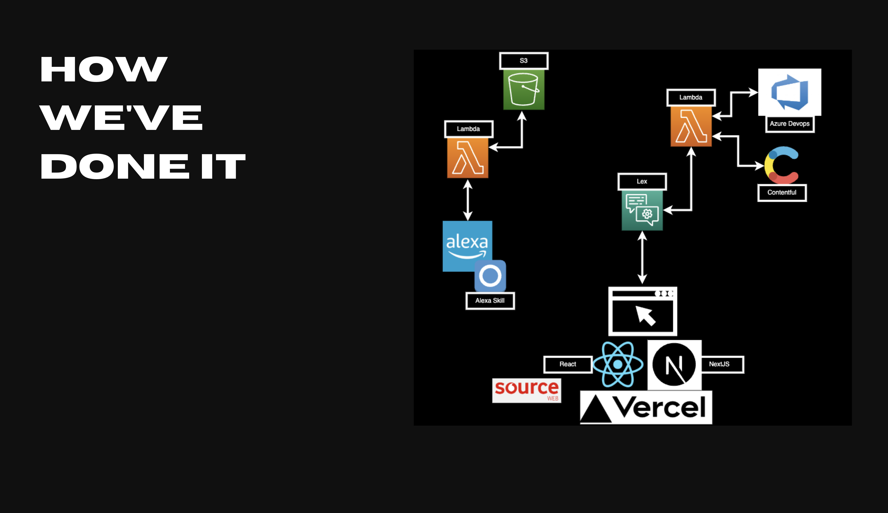

I participated in my first hackathon and thanks to the team effort and great work, we have won it. The name of the hackathon was inspired by Star Wars, “The empire strikes hack”.

In the hackathon, 22 teams from six different locations - London UK, Newbury UK, Riga Latvia, Cairo Egypt, and Prune India - participated with over 200 people involved. The hackathon had three problem statements which were sustainability, customer experience, and end-to-end journeys for customers, and connecting communities within Vodafone globally. Participants were allowed to select up to two problem statements, and I chose communities. We were then split into teams with other people who had chosen the same problem statement. Our team comprised individuals from different areas of Vodafone who had not met before.

The objective of the hackathon was to create a solution related to the chosen problem statement. Each team had seven minutes to present their idea with an additional three minutes for questions from the audience. During these seven minutes, we had to explain the problem we were trying to solve, sell the idea, demo the product we had built within two days, and explain the next steps for our project.

Our team and others were judged based on innovation and creativity, implementation and execution, presentation, and impact and project potential.

To prepare for the hackathon, our team wanted to make sure we were as prepared as possible to maximise our coding time. We began with an initial kickoff call where we introduced ourselves, assigned roles and responsibilities, and agreed on our tech stack. One of our first challenges was that our appointed leader was unable to attend, but we quickly adapted by organising ourselves and scheduling an additional call two weeks prior to the event.

During our first call, we struggled to interpret the problem statement and generate specific ideas. We discussed the different communities within Vodafone and their unique problems, but eventually realised they all shared one major issue - new members struggling to navigate and find the right communities. With an abundance of ideas, we decided to hold a follow-up meeting and use a Mural board to organise and prioritise our thoughts.

Our second call was more structured, and we were able to connect our ideas into user journeys. We collaborated and came up with the idea of building a chatbot that could assist users by directing them to the right resources, connecting them with the right people, or even helping new hires prepare for onboarding.

Our third call took place a few days before the event, where we discussed the technology we would be using and went over any additional preparations that could be helpful during the hackathon itself.

On the day of the hackathon, we had a clear understanding of the technical requirements and created user stories for each task on a sprint board. During the event, members of the team could assign themselves tasks from the board to keep track of which features had already been built, what needed to be prioritised to demonstrate a full journey, and what was left to be done.

To begin, we created the environment using NextJS and Vercel to deploy the product to the public. We designed the product using Figma and components from the internal library Source Web.

We set up a Github repository to collaborate on the code and started coding. We aimed to create a solution similar to Tobi, Vodafone's bot, and wanted to build our product on top of Tobi's existing solution, which was already highly rated by customers. Due to the short notice, we were unable to gain access to Tobi's API, so we asked a member of Tobi's team to explain how Tobi works behind the scenes, and we were explained the following architecture:

After being inspired, we opted to use AWS Lex for our chatbot solution. It's an Amazon Web Services offering that allows for the creation of voice and text conversational interfaces for applications. AWS Lex took the input from users and used keywords in messages to trigger different functions (Lambdas), which then accessed Microsoft Azure, our management system, to retrieve the relevant information. For instance, on the question "Who is in Raptors team?", the lambda retrieved the information from Azure and provided a list of names.

To improve the list's usability, we wanted to personalise the messages and make it more conversational. To achieve this, we incorporated Contentful into our solution. Based on the question asked, we fetched sentences with placeholders from Contentful, which we then filled with data from Azure.

On the second day, our main goal was to complete our initial product by assembling all the components, implementing the necessary logic, and preparing for the presentation to the judges. However, during the course of the day, a new idea emerged: we could extend our bot by creating an Alexa skill and allowing users to converse with their Alexa devices. Chris Allmark, one of our team's engineers, brought his Alexa device, and we quickly agreed to pursue this idea.

During the initial presentations, the teams were divided into five groups, and we had to compete against three other teams in our group. Luckily, all of our live demonstrations went smoothly, and the judges awarded us first place, moving us on to the second stage. In the second stage, the five winning teams from all the groups had the opportunity to present their ideas on the big stage in The Speechmark. After another successful presentation, everyone was impressed with our great idea combined with our excellent execution, and we were ultimately awarded as the winners!

This hackathon provided us with a unique opportunity to work on a project without the usual limitations that come with production code. We were able to move quickly and experiment freely, receiving immediate feedback at every stage from scoping to implementation.

It was also a great chance to explore new roles within the team, such as UX design, project management, and presentation design, in addition to our usual roles. We were able to learn how to work effectively with a new team and see how each member contributed to the project. This experience allowed us to work on something that had real business value in a safe and enjoyable environment.

